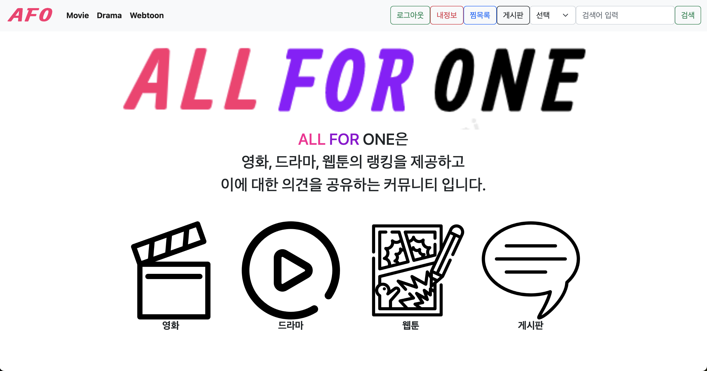
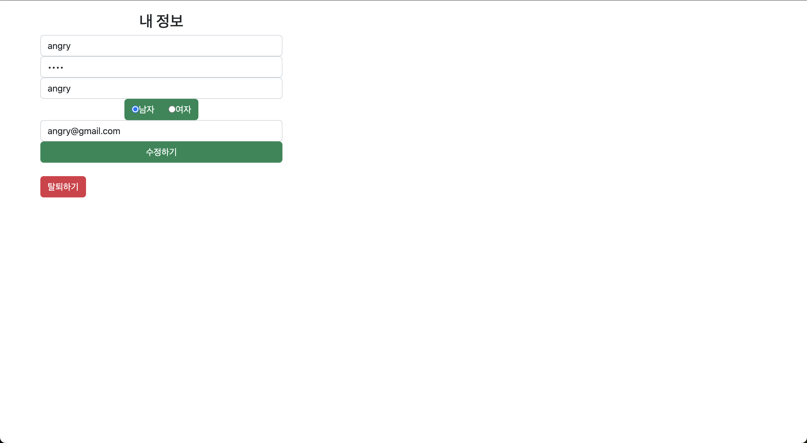
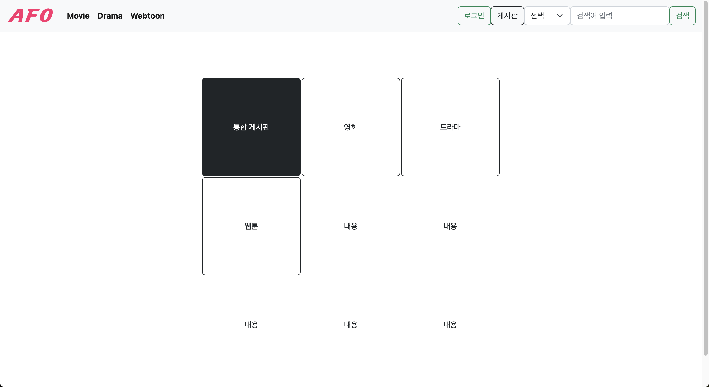
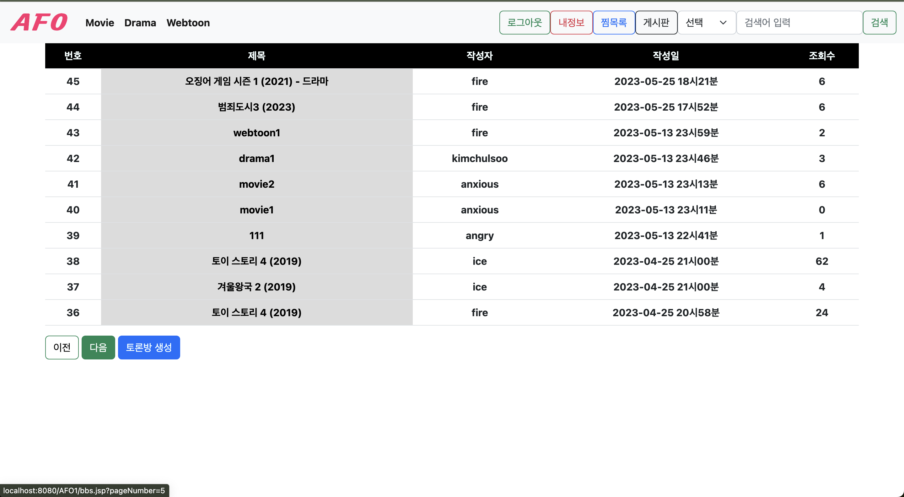
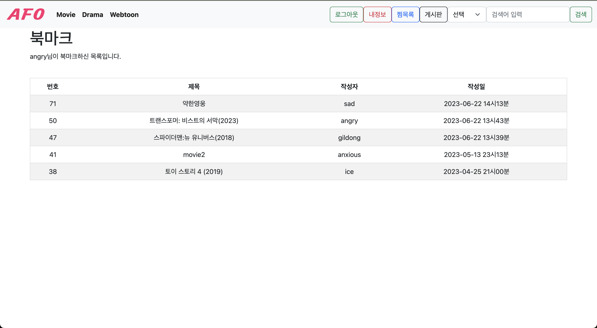
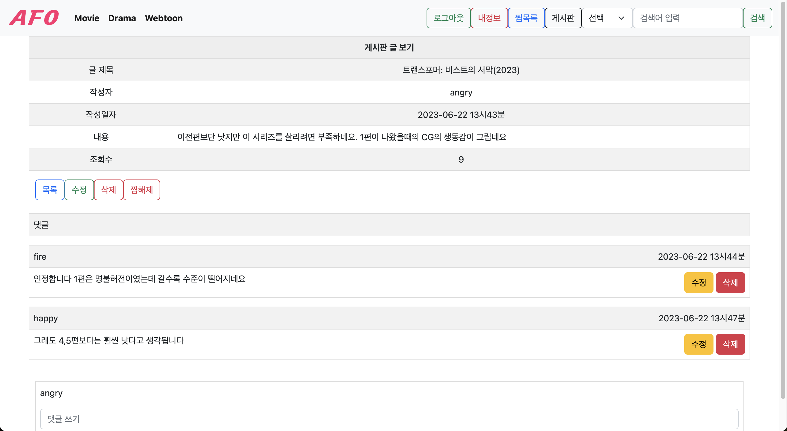

# AFO

 

# STACKS ⚒️

<b>Environment</b>

  
  
  
  
  
  

 
<b>Development</b>

  
  
  
  
  
  
  
  
  
  
  

 

<b>Communication</b>

  
  
  
  

 

# 화면 구성 🖥️

 

<table style="width: 100%; border-collapse: collapse;">
    <tr>
        <th style="border: 1px solid black; text-align: center; padding: 10px;"><b>메인페이지</b></th>
        <th style="border: 1px solid black; text-align: center; padding: 10px;"><b>드라마1</b></th>
        <th style="border: 1px solid black; text-align: center; padding: 10px;"><b>드라마2</b></th>
    </tr>
    <tr>
        <td></td>
        <td></td>
        <td></td>
    </tr>
    <tr>
        <th text-align: center;><b>개인정보확인</b></th>
        <th text-align: center;><b>통합게시판</b></th>
        <th text-align: center;> <b>게시판목록</b></th>
    </tr>
    <tr>
        <td></td>
        <td></td>
        <td></td>
    </tr>
    <tr>
        <th text-align: center;><b>찜목록</b></th>
        <th text-align: center;><b>영화토론방</b></th>
        <th text-align: center;><b>웹툰목록</b></th>
    </tr>
    <tr>
        <td></td>
        <td></td>
        <td></td>
    </tr>
</table>

 

# 주요 기능 💡

 

🔺 오리지널 콘텐츠에 대한 정보 부족으로 정기 구독 후 만족스럽지 못한 상황 방지 가능
<pre>
⭐️ 특정 콘텐츠에 대한 정보를 제공하여 사용자의 불확실성을 해소
⭐️ 오리지널 콘텐츠의 시놉시스, 출연진, 제작진 등의 정보를 제공
</pre>
 
🔺 OTT 서비스간 랭킹 정보 제공
<pre>
⭐ OTT 서비스의 콘텐츠를 비교하여 사용자가 쉽게 선택할 수 있도록 지원
⭐ 가장 인기 있는 콘텐츠 20위를 스크롤 방식으로 쉽게 확인 가능
</pre>
 
🔺 작품에 대한 나의 감상평 게시 및 공유
<pre>
⭐ 사용자가 직접 작품에 대한 감상평을 작성하고 공유할 수 있도록 지원
⭐ 작품의 장점과 단점, 감상평 등의 정보를 제공
</pre>
 

# 아키텍처 💡

 

