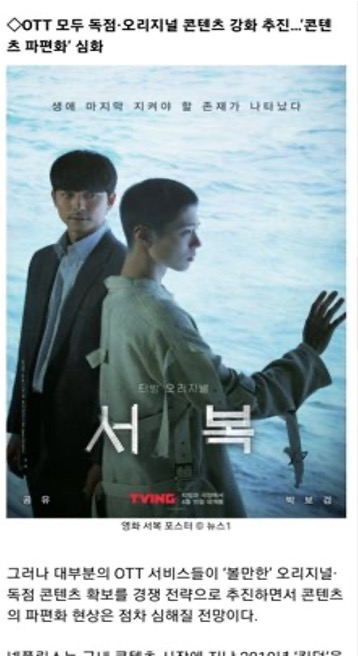
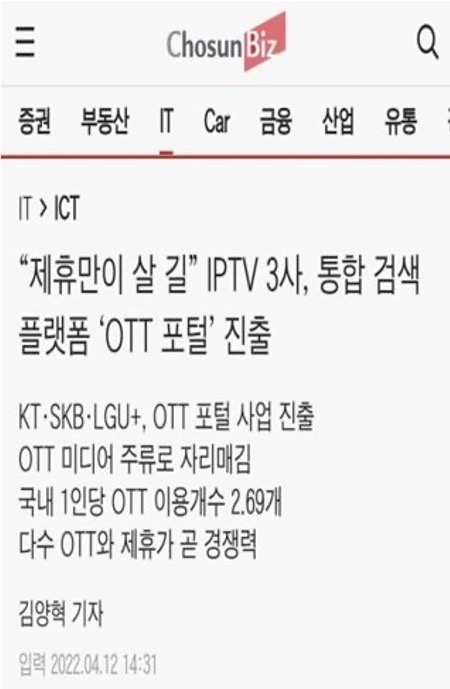
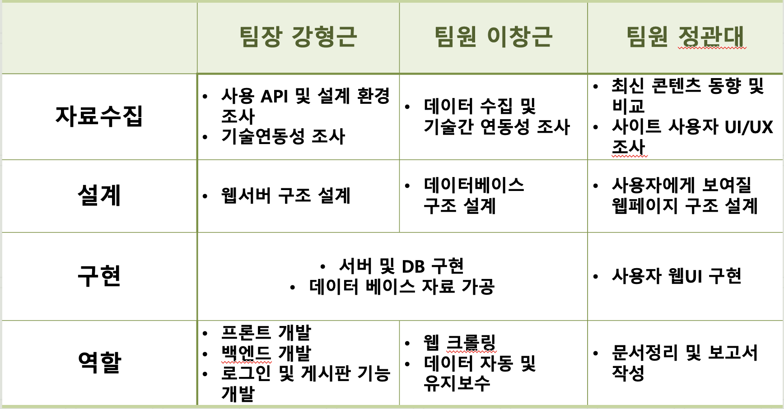

# 🔆 한국공학대학교 컴퓨터공학과 졸업작품 AFO(ALL FOR ONE)

 

<h2><b> ⚒️ 제작기간 22.09 ~ 23.06 </b></h2>

 

    <h1><b>💡 프로젝트 구상 이유</b></h1>

 
 

    <h2><b>🔥끊임없이 생성되는 OTT 서비스🔥</b></h2>

<table align="center">
    <tr>
        <th></th>
        <th></th>
        <th></th>
    </tr>
</table>
 

    <h2><b> 🔥 심화되는 OTT 경쟁 속 이용자가 원하는 인기 콘텐츠는 플랫폼별로 상이함 </h2></b>
 
    <h2><b> 🔥 그에 따라 콘텐츠의 플랫폼을 알려주는 서비스의 필요성 증가 </h2></b>

 
 

  <h1><b> 그로 인한 OTT 선택 피로 상승 😥</b></h1>

 

# ⚒️ STACKS 

<h2><b>Environment</b></h2>

  
  
  
  
  
  

  

<h2><b>Development</b></h2>

  
  
  
  
  
  
  
  
  
  
  
  
  
  

<h3><b> 🔥slick-slider, beautiful soup 추가! </b></h3>
  

<h2><b>Running Environment</b></h2>

  
  
  

  

<h2><b>Communication</b></h2>

  
  
  
  

  

# 🖥️ 화면 구성 

 

<table style="width: 100%; border-collapse: collapse;">
    <tr>
        <th style="border: 1px solid black; text-align: center; padding: 10px;"><b>메인페이지</b></th>
        <th style="border: 1px solid black; text-align: center; padding: 10px;"><b>드라마1</b></th>
        <th style="border: 1px solid black; text-align: center; padding: 10px;"><b>드라마2</b></th>
    </tr>
    <tr>
        <td></td>
        <td></td>
        <td></td>
    </tr>
    <tr>
        <th text-align: center;><b>개인정보확인</b></th>
        <th text-align: center;><b>통합게시판</b></th>
        <th text-align: center;> <b>게시판목록</b></th>
    </tr>
    <tr>
        <td></td>
        <td></td>
        <td></td>
    </tr>
    <tr>
        <th text-align: center;><b>찜목록</b></th>
        <th text-align: center;><b>영화토론방</b></th>
        <th text-align: center;><b>웹툰목록</b></th>
    </tr>
    <tr>
        <td></td>
        <td></td>
        <td></td>
    </tr>
</table>

 

# 💡 주요 기능 

 

🔺 오리지널 콘텐츠에 대한 정보 부족으로 정기 구독 후 만족스럽지 못한 상황 방지 가능
<pre>
⭐️ 특정 콘텐츠에 대한 정보를 제공하여 사용자의 불확실성을 해소
⭐️ 오리지널 콘텐츠의 시놉시스, 출연진, 제작진 등의 정보를 제공
</pre>
 
🔺 OTT 서비스간 랭킹 정보 제공
<pre>
⭐ OTT 서비스의 콘텐츠를 비교하여 사용자가 쉽게 선택할 수 있도록 지원
⭐ 가장 인기 있는 콘텐츠 20위를 스크롤 방식으로 쉽게 확인 가능
</pre>
 
🔺 작품에 대한 나의 감상평 게시 및 공유
<pre>
⭐ 사용자가 직접 작품에 대한 감상평을 작성하고 공유할 수 있도록 지원
⭐ 작품의 장점과 단점, 감상평 등의 정보를 제공
</pre>
 

# 💡 아키텍처 

 

<h2> ⚡️ 시스템 구상도 </h2>
 

    

 
 

<h2> ⚡️ 시스템 모듈 설계 </h2>
 
<table>
  <tr>
    <th>
      
    </th>
    <th>
      
    </th>
  </tr>
</table>

 

# 팀원 
 
<pre>
팀장: 강형근
팀원: 이창근, 정관대
</pre>

 

# 역할분담
 
<pre>
    
    
</pre>

